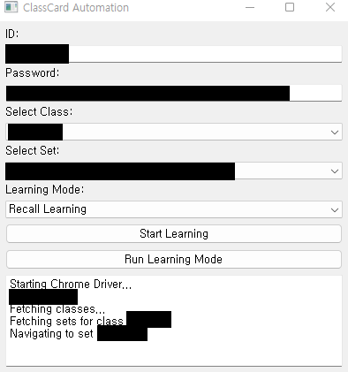

# 포크
본 리포지토리는 김준성님께서 제작하신 classcard_auto를 업데이트된 classcard에서 동작하도록 포크하여 제작하였습니다.

# 수정사항
### main.py 

* Classcard에서 세롭게 업데이트한것에 동작할수 있도록 수정
  
* 세롭게 업데이트된 Selenium에서 동작할수 있도록 수정

* 필요없는 webdriver.autoinstaller 삭제 (Selenium에서 없어도 실행가능함.)

# 주의 사항
본 풀리퀘스트는 완성되지 않았습니다. 단순히 main.py와 여러 라이브러리들만 수정하였습니다.

동작하지 않은 기능들은 다음과 같습니다.


* ~~암기학습~~
> 암기학습 메크로는 241015에서 작동되게 수정하였습니다.
> 테스트 학습도 수정중입니다!
> 
> ~~시험기간이라 언제 끝날지 몰라요..ㅎ~~


* 테스트

> 혹시 몰라 test_learning.py는 남겨놓겠지만 사용하지 않습니다.


# 설치파일
본 프로그램은 설치파일을 제공합니다. 설치프로그램은 다음과 같은 항목을 설치합니다.

* 파이썬 embedded package

* 프로그램 작동을 위한 라이브러리

* 과도한 사용을 방지하기 위한 인증 프로그램

본 프로그램은 과도한 사용을 방지하기 위한 인증 프로그램이 포함되어있습니다. 인증이 없을시 프로그램을 사용할수 없습니다.

인증프로그램은 키 발급페이지에서 발급받은 키를 시용할수있으며 한 PC당 하나의 프로그램을 사용할수 있습니다.


매번 인증을 하지 않고 본깃헙에서 소스를 가져와서 파이썬으로 실행해도 동작합니다.

## 설치프로그램은 릴리즈 항목에서 다운로드가 가능합니다.
> 프로그램 실행시 ```Created TensorFlow Lite XNNPACK delegate for CPU.``` 이문구는 Selenium에서 출력되는 메시지입니다.

# 향후 개발
뭐 이걸 개발이라해도 뭐하지만 PyQt5 공부용으로 GUI를 넣어보고있습니다.





~~역시 PyQt5.. 나만힘든게 아니였어~~
이런형식으로 될것 같네요

# 클래스카드 오토 매크로

> [!Warning]
> 학습 목적으로만 사용해주세요.<br>
> 해당 프로그램을 사용하여 발생한 모든 문제는 사용자에게 책임이 있습니다.

## 시연영상

https://github.com/kimjunsung04/classcard_auto/assets/70435510/3261a3ad-7820-4796-9cfd-48d01957f699

## Restrictions / 제한

 - 단어 세트에서만 가능하고 문장, 드릴 등 다른 세트에서는 사용 불가합니다. 

## Getting Started / 어떻게 시작하나요?

### Prerequisites / 선행 조건

아래 사항들이 설치가 되어있어야합니다.

```
Python, Chrome
```

### Installing / 설치

1. 초록색 'Code' 버튼을 눌러 코드를 다운받습니다. 
2. 터미널을 열어 파이썬 모듈을 설치합니다. 
아래 명령어로 프로젝트에 필요한 파이썬 모듈들을 설치할 수 있습니다.

```
pip install -r requirements.txt
```

3. 구동은 아래 명령어로 가능합니다.

```
python main.py
```

## Technologies / 구현방법

셀레니움을 이용하여 자동화를 하였습니다.
리콜, 스펠, 테스트 학습 이전에 단어표를 먼저 학습하고, 
맞는 단어끼리 매칭하여 정답을 맞추는 방식으로 구현하였습니다.

## Issues / 이슈

동작에 문제가 있다면 사용환경, 오류코드를 꼭 남겨주세요.

## Contribution / 기여

소스 수정사항이 있다면 Pull requests 로 열어주세요.

## License / 라이센스

이 프로젝트는 MIT License 라이센스가 부여되어 있습니다.
